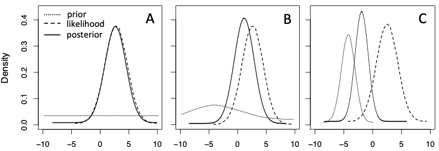

# Introduction to Bayesian inference {#introbayesian}

Bayesian inference is increasingly recognised as an essential tool for modelling ecological data. The Bayesian approach contrasts with more widely used _frequentist_ statistics. Bayesian inference actually pre-dates frequentist statistics by about 200 years, and has important advantages, particularly in the context of ecological modelling, since it lends itself to small data sets and decision making.

Bayesian inference is attributed to the Reverend Thomas Bayes, an 18th Century English clergyman, philosopher and statistician. His ideas were subsequently expanded by the French polymath Pierre-Simon Laplace. Frequentist statistics were developed much later, largely in the 20th Century, by several figures including the brilliant British geneticist and statistician Sir Ronald Fisher and Polish mathematician Jerzy Spława-Neyman.


## The differences between Bayesian and frequentist approaches {#freqbayes}

There are several important differences in the Bayesian and frequentist approaches that relate to the way uncertainty is handled.

### Frequentist approach {#freq}

In a frequentist framework, inferences are based on the probability (P) of the data (D) given the hypothesis (H);

:::{.theorum}
_P(D|H)_
:::


The way this approach is implemented is to test data against a null hypothesis by asking the question: What is the probability that we would obtain our set of data, if the null hypothesis was true?

If the probability (or P-value) that the data support the null hypothesis is small, the null hypothesis is rejected. The critical cut-off for a ‘small’ P-value is typically taken to be 0.05, though this threshold is entirely arbitrary (and set too high, see @Benjamin_2017).

Note that if the null hypothesis is rejected, it is incorrect to conclude that the alternative hypothesis is correct. It is also erroneous to conclude that in the case of a large P-value (i.e. one that  exceeds 0.05) that the data support the null hypothesis.

From a frequentist perspective then, it is only possible to make probability statements about data, not the hypothesis of interest. A frequentist treats parameters in a model as fixed but unknown quantities that do not have probabilities associated with them. Uncertainty is expressed solely as the frequency probability of data sets generated by hypothetical repeated sampling. 

While unsatisfactory on the basis that it is impossible to draw direct inferences about quantities of interest, a frequentist approach is (superficially at least) objective, since conclusions are based solely on the data. In reality, decisions relating to experimental design, data collection, and choice of the variables to analyse unavoidably introduce subjectivity into any frequentist analysis. 


### Bayesian approach {#bayesian}

In contrast to the frequentist approach, Bayesian inference provides a measure of the probability of the hypothesis being true given the data;

::: {.theorum}
_P(H|D)_
:::

As a consequence, Bayesian inference permits fundamentally different conclusions to be drawn with respect to probability. In Bayesian inference, model parameters are modelled as random variables with knowable quantities and probability is a direct measure of 'degree of belief'. Because probability is a measure of uncertainty, it is possible to make clear probability statements about unknown quantities, given the data and including by considering existing information. 

So, while frequentists work with point estimations of parameters, based on means and variance, Bayesians generate posterior distributions of parameters given both the data and some prior information (or simply priors). The end result is that a Bayesian approach provides a fuller picture of uncertainty and permits probability statements about model parameters to be made with greater certainty.

The _priors_ used in a Bayesian analysis may be vague (‘non-informative’), slightly explanatory (‘weakly informative’) or quite specific (‘informative’), but all must be specified in a model fitted using Bayesian inference. The prior distribution is an important feature of Bayesian inference and permits the inclusion of existing information into an analysis, something that is difficult to perform in a frequentist framework. 

Selection of an appropriate prior distribution may be based on information from previous published studies, experience, expert opinion, or theoretical models. Thus prior information serves to link models with previous studies, and thereby mirrors the scientific process of accumulating information and using it to update understanding of a system. Further consideration is given to the choice of priors below (see Section \@ref(intro-priors)).

Verbally, Bayes’ rule can be summarised as:

_posterior_ $\propto$ _likelihood_ $\times$ _prior_

Thus, the posterior distribution is proportional to the evidence (in the form of data and expressed as the likelihood function) in combination with prior knowledge about a system.

Although Thomas Bayes formulated his theorem before the advent of frequentist statistics, solving Bayes’ rule without a computer is difficult for all except the most simple models. In contrast, frequentist models are readily soluble, even for quite complex models, and as a consequence this approach has dominated ecological data analysis, see @McGrayne_2011 for an accessible history. However, the discovery of simulation techniques to generate posterior distributions, such as Markov chain Monte Carlo (MCMC) algorithms, and the advent of sufficiently powerful personal computers that can simulate posterior distributions, means that Bayesian techniques are now readily available to ecologists

### Bayes' theorum {#theorum}

With Bayesian inference we can ask the question: What is the probability that our hypothesis is true, conditional on the data? This probability can be estimated using _Bayes theorem:_

\begin{equation*} 
P(H|D) = \frac{P(D|H) \times P(H)}{P(D)}
\end{equation*}

The probability of the hypothesis given the data; i.e. _P(H|D)_, is referred to as the _posterior distribution_. The quantity _P(D|H)_ is the _likelihood_ and reflects the data. The quantity _P(H)_ is the _prior probability distribution_, often just called the _prior_. The prior reflects information about the hypothesis that is independent of the data. Finally _P(D)_ is the _marginal probability density_, which serves as a normalising constant across all possible hypotheses.

An essential feature of the Bayesian approach is that probability is explicitly subjective and represents a measure of _degree of belief_. The Bayesian posterior distribution is an expression of that degree of belief and is the product of the likelihood and prior, which means that both data and existing information contribute to a probability estimate.

While a frequentist tests a null hypothesis and assumes no relevant information, irrespective of the number of times the same null hypothesis may have been examined previously, a Bayesian takes advantage of existing information to formulate the probability of whether an hypothesis is supported.

Bayes’ theorem also lends itself to iterative exploration of probability. From a starting point with little prior information, data can be collected that can subsequently be used to generate more informed priors. The Bayesian approach is consequently highly responsive to new findings and can be used in the context of adaptive resource management, for example in wildlife management and clinical trials.

### A frequentist or Bayesian framework? {#which}

While the frequentist _vs._ Bayesian debate represents an intriguing philosophical argument about how science should be undertaken, it is acceptable to employ both approaches. For the foreseeable future a frequentist framework will continue to be taught at undergraduate and postgraduate levels in ecology, and it is certainly beneficial to master frequentist statistics irrespective of an acceptance of the Bayesian paradigm. However, in cases where limited data are available and where robust prior information exists, a Bayesian approach offers a valuable alternative tool for modelling ecological data.

In some cases, for example phylogenetic analysis or spatial-temporal modelling, frequentist options are not available and a Bayesian approach is the only one on offer. However, we also see utility in implementing Bayesian inference in fields such as ecological resource management where an iterative adaptive management approach is particularly meaningful. We also advocate the adoption of Bayesian inference as a tool for furthering the 3Rs principle (Replacement, Reduction and Refinement) by serving to help minimise the number of animals used in experiments, thereby supporting humane research using animals.

## Fitting Bayesian GLMs {#fit-glms}

Whether fitted in a frequentist or Bayesian context, General and Generalized Linear Models (GLMs) allow the prediction of a response (or dependent) variable by either single or multiple independent variables. Independent variables (or covariates) may be continuous, categorical or a combination of both. Statistical analyses such as t-tests, ANOVA, ANCOVA and regression are types of GLM in which the independent variables are either categorical (t-test and ANOVA), continuous (regression) or a mix of both categorical and continuous (ANCOVA). The difference between General Linear Models and Generalized Linear Models is simply the way that error (i.e. the variation in the data that is not explained by the model) is handled. In a General Linear Model, errors are assumed to be independent and follow a Gaussian (normal) distribution. In a Generalized Linear Model, other data distributions can be used as an alternative to normally-distributed errors. Typical data distributions used in Generalized Linear Models are binomial, Poisson, negative binomial, beta and gamma distributions, though a wide range of distributions can potentially be used, giving great flexibility in how models can be fitted to data. We present examples of Gaussian (a General Linear Model), Poisson, negative binomial, gamma, Bernoulli and gamma GLMs in this book. Hereafter we will not distinguish between General and Generalized Linear Models and will refer to both simply as GLMs, though with a qualifier to indicate the error distribution (i.e. Gaussian GLM, Poisson GLM, etc.).

### Steps in fitting a Bayesian GLM {#fit-steps}

We recommend the following 9 steps to fitting a Bayesian GLM, modified from [@Kruschke_2015] and [@Zuur_2016].

1.  _State the question_
Formulating a coherent research question before data collection is a critical exercise in ecology since it informs experimental design or sampling and identifies which data variables are to be predicted and which are predictors. If you do not know your research question, do not start data collection.

2. _Perform data exploration_
A thorough exploration of the data is a critical element to any analysis. This step provides insights into the structure of the data, underlying trends and patterns, and will highlight potential pitfalls in fitting a GLM. See Chapter 3 for a full treatment of data exploration. 

3. _Select a statistical model_
Careful formulation of a model, and its explicit presentation using mathematical notation, facilitates transparency and repeatability of your data analysis. Consideration should be given to the nature of the response variable and a decision made on the most appropriate error distribution (Gaussian, Poisson, binomial, Bernoulli, gamma, etc.). Choice of a suitable model should also recognise the data structure and accommodate any potential dependency in the data, which is a common feature of ecological studies.

4. _Specify and justify a prior distribution on parameters_
Priors are a prominent component of a Bayesian GLM and their careful definition is critical. Priors must be biologically plausible and clearly stated. See Section \@ref(intro-priors) below for further discussion of the types of prior that can be implemented in a Bayesian GLM.

5. _Fit the model_
At this step the model is executed using appropriate statistical software. We fit models using R. 

6. _Obtain the posterior distribution_
The posterior distribution for the model parameters are determined by the priors and the likelihood and can be obtained by analytical or mathematical approximation methods, including Markov chain Monte Carlo (MCMC) simulation and Laplace approximation. These alternatives are discussed in Section \@ref(comp-methods) below.

7. _Conduct a posterior predictive check_
This is a critical model validation step to examine the fit between the model and the data. It is performed to ensure that the fitted model complies with assumptions.

8. _Interpret and present the numerical output of the model_
Model output, which can be voluminous, must be extracted and tabulated. For Bayesian GLMs, this typically includes as a minimum the posterior mean values and 95% credible intervals. These outputs must be interpreted correctly in the context of the research question.

9. _Visualise the results_
As an aid to interpreting the results and comprehending what they mean, a graphical representation of the fitted model is hugely valuable. 

Execution of these 9 steps will be comprehensively illustrated for a series of GLMs presented in Chapters 4 - 8.

## Priors {#intro-priors}

An essential difference between frequentist and Bayesian approaches is the inclusion of prior information (‘priors’) in a Bayesian framework. To implement a Bayesian GLM it is necessary to specify a prior distribution, in the same way that we identify an error distribution and link function.

The prior distribution offers an opportunity to include existing knowledge in a model. The goal of implementing priors is not to bias the results so that a specific outcome is obtained, but rather to keep parameter estimates within a range that is biologically plausible, and ideally building on previous (but necessarily imperfect) results.

However, priors represent assumptions, and like any assumptions these need careful scrutiny and deserve reasonable criticism. Priors may convey varying degrees of influence on the posterior distribution, though all contain some information.


### Non-informative priors {#flat-priors}

_Non-informative_ (or _uninformative_) priors are commonly used in Bayesian GLMs in ecology. The term non-informative is somewhat misleading since all priors contain some information. An example of a non-informative prior would be a uniform distribution that permitted all possible outcomes with the same probability.

The intention in using non-informative priors is typically to limit the influence of the priors on the posterior distribution such that they have minimal effect relative to the data. The assumption that non-informative priors convey limited information can be violated in the case that the parameter of interest is transformed, for example if a link function is used.

Some non-informative priors are termed _vague_, _flat_ or _diffuse_ priors and are used in cases when there is limited information about the parameter on which they are placed. In this case, priors are set to a plausible range of values that reflects the deficiency in knowledge regarding the parameter.

A drawback of using a Bayesian GLM with non-informative priors is that it yields the same results as a frequentist analysis, which raises the question of why a Bayesian approach would be adopted when a major strength of Bayesian inference is the opportunity to explicitly combine existing knowledge with new data.

### Weakly-informative priors {#weak-priors}

_Weakly-informative_ priors are a class of priors in which parameters are mildly constrained, with the effect of stabilising the posterior distribution and regularising parameter estimates. Weakly-informative priors are not intended to substantially change the posterior distribution, but have the advantage of incorporating existing scientific information in their formulation. An outcome is that the risk of type I errors (false positives) is limited, even with low-powered data (i.e. small sample sizes with high variance).

The adoption of weakly-informative priors can be advocated on the basis that it does not abandon ‘objectivity’ while also embracing a Bayesian approach. An advantage of using weakly informative over non-informative priors is that analyses are more conservative as well as potentially more accurate.

### Informative priors {#inform-priors}

_Informative_ (or _substantive_) prior distributions are conspicuously underutilised by ecologists [@Banner_2020]. A reason for their underemployment may be because non-informative priors are perceived as more objective, or because informative priors risk reducing model accuracy, though neither concern seems justified. 

Informative priors are carefully formulated on the basis of results from pilot data, related empirical studies, existing data, or expert opinion. Appropriately formulated priors must not introduce bias to the posterior distribution, but should increase model precision. While compelling arguments can be readily made for ecologists to more enthusiastically employ informative priors, a robust and widely accepted protocol for doing so is currently lacking and caution should be exercised in their use. In practice the use of informative priors must be accompanied by full transparency in their origin and impacts on model outcomes.

A powerful way to use informative priors is to encode biological plausibility into ecological models. For example, we may wish to limit the probability of a negative relationship between weight and length in a sample of fish. Even without explicit prior information, an ecologist should have sufficient understanding of the study system to specify a plausible range of values to use as informative priors.

Priors should always be fully reported for a model, but particularly in the case of informative priors which require explanation and justification. Note that there is no reason to use only a single prior on a model parameter, particularly if there is no compelling reason to do so, and examining multiple priors, for example along a gradient of information, can provide great insights. 

If the posterior distribution is sensitive to the choice of prior we need to be cautious in our interpretation of the results. In this case a _prior sensitivity analysis_ is warranted and should be presented.

### Conjugate priors {#conj-priors}

If the prior distribution belongs to the same family of probability distributions as the posterior distribution, then the prior and posterior are _conjugate distributions_, and the prior is termed a _conjugate prior_.

Conjugate priors simplify estimation of the posterior distribution, which is not a trivial problem for complex models and large datasets. Consequently, when we select priors for model parameters our choice of prior distribution should consider conjugate priors, unless no conjugate priors can provide a realistic representation of our prior assumptions.

Table 2.1: **Examples of conjugate priors**

|Likelihood|Prior  |Posterior|
|:--------|:-------|:--------|
|Gaussian  |Gaussian |Gaussian |
|Poisson   |Gamma    |Gamma    |
|Negative binomial|Beta  |Beta |
|Gaussian  |Beta     |Beta     |
|Gaussian  |Beta     |Beta     |
|Gaussian  |Gamma    |Gamma    |

## The posterior distribution {#post-dist}

Bayes’ theorem allows us to combine a prior distribution and observed data into a single distribution; the _posterior distribution_. The relative contributions of the prior and data to the posterior distribution are weighted according to the information they provide. If we use an uninformative prior distribution, the posterior distribution equals the likelihood and the conclusions drawn from our Bayesian GLM are the same as for a frequentist GLM The more informative our prior information, the stronger the influence the prior has on the posterior distribution, and the more likely the inferences we draw from the model will differ from those of a frequentist GLM (Fig. \@ref(fig:param-plot)).

(ref:param-plot) **Prior, likelihood and posterior distribution of a parameter value using; A. noninformative prior; B weakly informative prior; C informative prior.**

```{r param-plot, fig.cap='(ref:param-plot)', out.width='100%', fig.align='center', echo=FALSE, warning=FALSE, message=FALSE}

```

For a model with more than a single parameter, the posterior distribution encapsulates the contribution of all model elements. In this case the posterior distribution is termed the _joint posterior distribution_. If we wish to look at each model parameter separately, we can do this by obtaining the _marginal posterior distribution_ for the parameter. We can also examine the posterior distribution for a single parameter with a specific value assigned to the other model parameters; this is called the _conditional posterior distribution_.

Summary statistics can be obtained from the posterior distribution for model coefficients. These are typically the _posterior mean_ and _95% credible intervals_, which are equivalent to maximum likelihood estimates and 95% confidence intervals in a frequentist GLM. However, unlike confidence intervals, which assume large sample approximations and represent the range of values that contain the true parameter for 95% of repeated samples, Bayesian credible intervals provide an interval containing the true parameter value with 95% probability and are appropriate for small samples. 

## Bayesian computational methods {#comp-methods}

While Bayesian inference offers a coherent and intellectually satisfying approach to modelling ecological data, computation of posterior distributions involves multidimensional integration, which is computationally highly demanding. In the case of simple conjugate models, exact computation is possible. However, ecological models are rarely appropriate for this approach and calculating the true posterior distribution numerically is problematic. Two alternative computational approaches are available to obtain estimates of posterior distributions; Markov chain Monte Carlo sampling and numerical approximation.

### Markov chain Monte Carlo sampling (MCMC) {#mcmc}

One option is to draw a Monte Carlo random sample from the joint posterior distribution. A Markov chain Monte Carlo sample drawn from the posterior will approximate the true posterior when the sample size is large. This approach is analogous to treating the posterior distribution as a large population of data from which samples are repeatedly drawn. Each random draw is correlated with the previous, but given a sufficiently large set of samples, the sample distribution should converge on the true population distribution.

There are numerous R packages which can be used to implement MCMC for specific classes of model. For example, the `BEST` package is a Bayesian alternative to _t_ tests. There are also software packages that permit a wide range of MCMC-based Bayesian models to fitted. Examples are _JAGS_ and _STAN_. These run separately from R, but can be called from R using specific R packages, for example `R2jags` in the case of _JAGS_.

While MCMC offers a powerful method for posterior inference, in practice model convergence can be excessively time consuming. MCMC diagnostics is complicated and, because the outcome of MCMC is random, replicability is not assured. 

### Numerical approximation {#inla}

An alternative to MCMC for obtaining a posterior distribution is offered by an approach that derives approximate solutions to numerical integration. Laplace approximation uses a normal distribution to approximate the posterior distribution and is able to generate accurate approximations. Notably, numerical approximation is substantially faster than MCMC, making exploration of Bayesian models more practical.

Integrated nested Laplace approximation (INLA) is a particularly user-friendly computational method [@Rue_2009]. Instead of estimating a multivariate joint posterior distribution, which is difficult to obtain, INLA focuses on individual posterior marginal distributions of model parameters. The INLA R package offers a full suite of Bayesian tools. We use R-INLA throughout this book for fitting Bayesian GLMs and recommend [@Wang_2018] and [@G_mez_Rubio_2020] for fuller discussion of the theory of INLA.

## The advantages of Bayesian inference {#bayes-pros}

Bayesian inference offers an alternative framework to the classical frequentist approach and has a number of advantages:

1. Bayesian inference explicitly permits the inclusion of informative priors, enabling existing knowledge or results from a previous model, study, or from expert opinion to inform the current model.

2. Bayesian inference treats the data as fixed (which it is), and model parameters to be random (since they are unknowns). In contrast, frequentist inference considers the unknown parameters to be fixed, and the data to be random.

3. Bayesian inference provides answers based on the observed data and not based on the distribution of estimators or test statistics from imaginary samples.

4. Bayesian inference includes uncertainty in the probability model, yielding more realistic predictions. Frequentist inference does not include uncertainty of parameter estimates, yielding less realistic predictions.

5. Bayesian inference estimates a full probability model. Frequentist inference does not and there is no frequentist probability distribution associated with parameters or hypotheses.

6. Bayesian inference utilises observed data only. Frequentist inference uses both observed data and future data that is unobserved and hypothetical.

7. Bayesian inference permits more complicated models to be fitted than are possible in a frequentist framework.

8. Bayesian inference is unbiased with respect to sample size and can accommodate any sample size no matter how small. Frequentist inference becomes more biased as sample size decreases from infinity, and is markedly biased with small samples.

## Criticism of Bayesian inference {#bayes-critics}

While the Bayesian approach appears to have several advantages over the frequentist approach. It presents new problems of its own, not least its greater complexity. Arguments presented against Bayesian inference typically revolve around the first two advantages of Bayesian inference listed in Section \@ref(bayes-pros):

1. Incorporating a prior introduces subjectivity into statistical modelling. 

2. Whether data and hypotheses can hold the same status as random variables; i.e. it is unreasonable to place a probability distribution on model parameters.

A counter to the first argument is that all statistics are demonstrably subjective. From data collection, choice of variables, choice of likelihood, link function, etc. Indeed the choice of threshold for asserting a result to be ‘statistically significant’ is an entirely subjective judgement, and one that is often abused through the practice of 'P-hacking'. A Bayesian approach is at least explicit in acknowledging subjectivity and considers how the degree of subjectivity impinges on the conclusions derived from a model.

To the second argument, a Bayesian would argue that whether a parameter should be rightly considered as fixed is irrelevant, since we are uncertain about its true value. As a result, imposing a probability distribution on a parameter is reasonable, since it reflects our uncertainty about a parameter’s true value.


## Conclusions {#bayes-concl}

Bayesian inference offers an alternative framework to data analysis to the classical frequentist approach and has a number of advantages. One is that prior information can be incorporated into an analysis. Using prior information in a model is intuitively appealing and better reflects the scientific method of building on previous knowledge. A second advantage is in avoiding hypothesis testing and P-values, which do not allow us to draw direct conclusions about model parameters; only about hypothetical data that will never be collected. Finally, there is a large range of advanced statistical methods that can only be performed in a Bayesian setting, and for this reason alone ecologists should gain some understanding of the Bayesian approach.
